#  Tess Trenear - Portfolio Task
​
[My portfolio site](https://tesstrenear.github.io/)
​
## Project Requirements

### Content
Profile picture: 
- I have uploaded a professional profile picture

Biography:
- I have included lorem ipsum text as placeholder until I come up with content

Projects section:
- I have three project placeholders with image title and short description

Links to external sites:
- I added a link to my Github site
​
### Technical
Images: 
- Created organised image directory structure.

Font: 
- Used Roboto font from google fonts.

Pages:
- Added a homepage (index.html) and a projects page with placeholders (projects.html). These are linked via the nav bar on top.

Accessibility:
- Used the chrome extension [accessibility insights](https://accessibilityinsights.io/docs/web/overview/) to ensure WCAG complaincy. 
- Used landmarks (nav / main / footer)
- Used proper headings in order i.e h1 -> h2 -> h3
- Used aria labels on links without text

Design:
- Generated a colour pallette using [coolors](https://coolors.co/474448-2d232e-e0ddcf-534b52-f1f0ea) as recomended -> used this as a small design system in which no other colours were used outside ofg this pallette 

Version control:
- Version controlled using git 
- Workflow being: make new branch per task -> add and push to origin -> checkout to master, rebase and then push to origin main (main being source of truth)
- Deployed to GHPages via main branch 
- [link to my GitHub page](https://github.com/TessTrenear/TessTrenear.github.io)

Responsiveness:
- Used media query in styles.css 
- Mobile first approach in which default styles were applied to mobile and then a defined desktop media query at 1024px defined desktop 

### Bonus (optional)

Hover state:
- Added hover states in the nav 
- Added a transition all with duration animation property to make it the hover state look less janky + smooth colour change tranition 
​
### Screenshots

####  Wireframe - Desktop Home Page
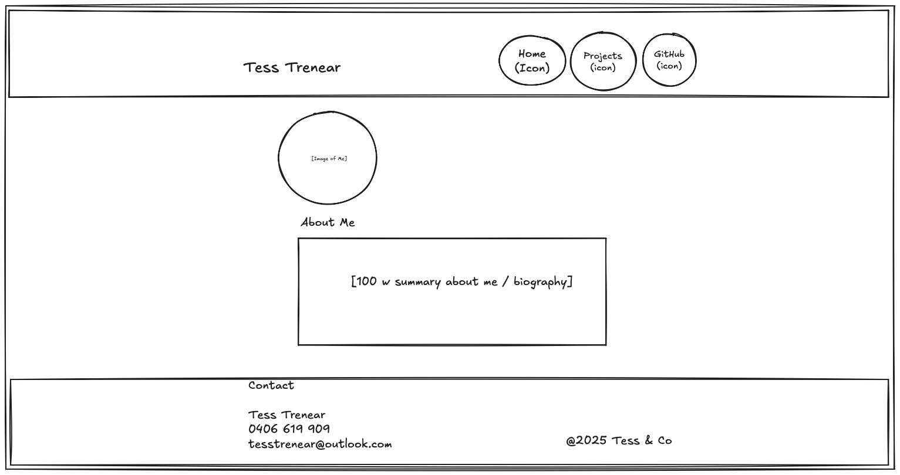

####  Wireframe - Desktop Projects Page
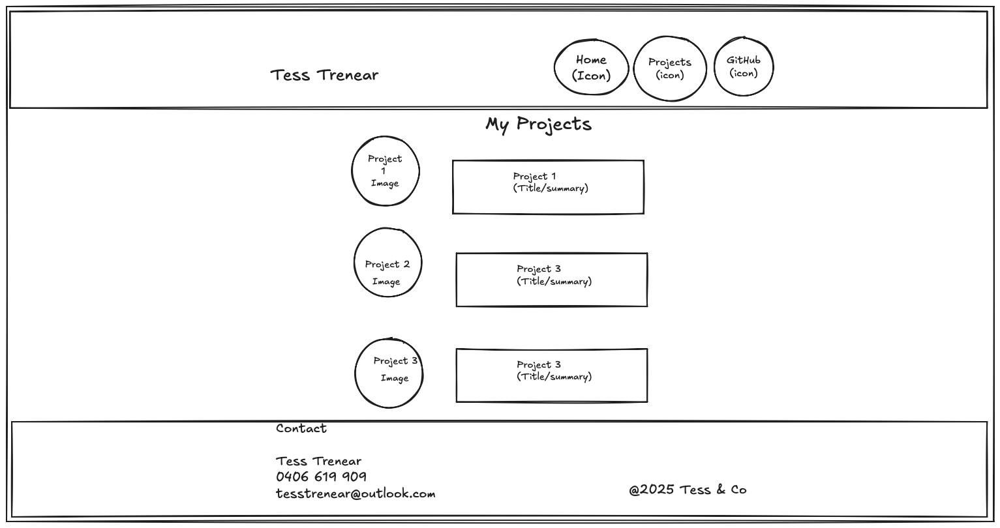

####  Wireframe - Mobile Home Page
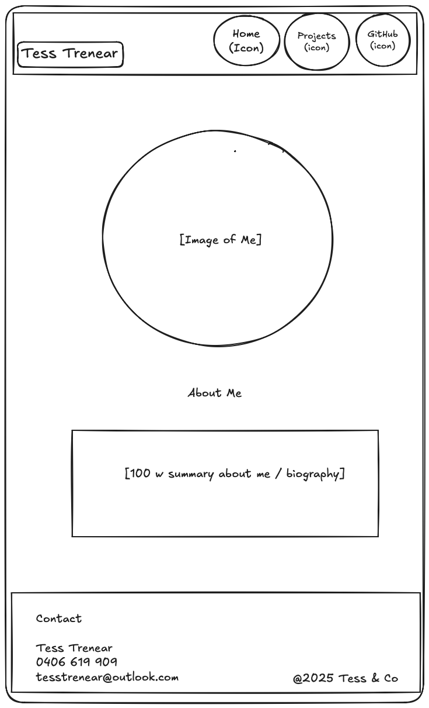

####  Wireframe - Mobile Projects Page
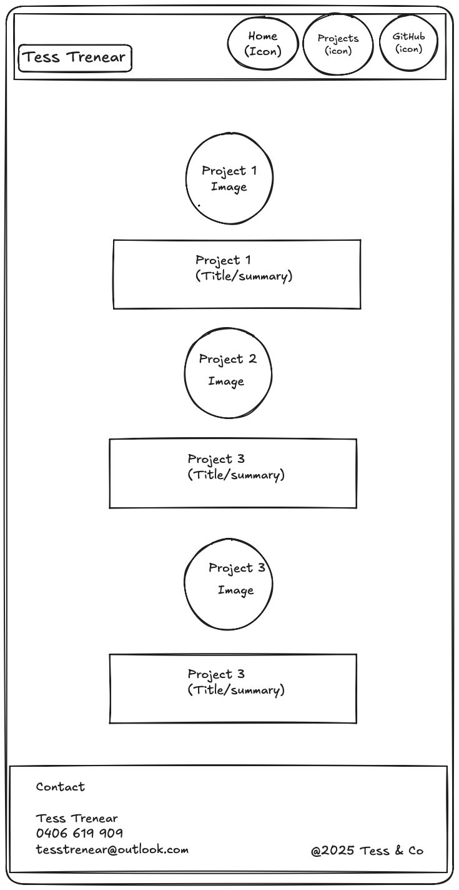

####  Mobile - Home Page
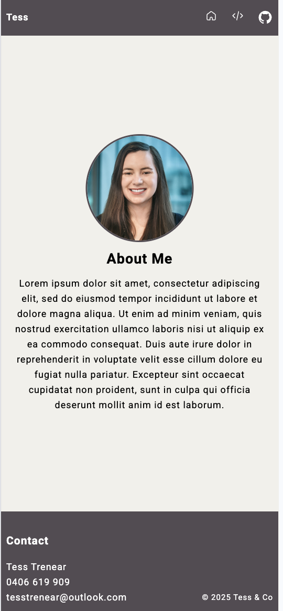

####  Mobile - Projects Page 1
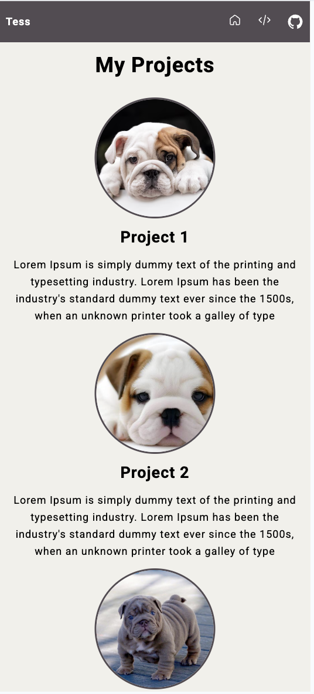

####  Mobile - Projects Page 2
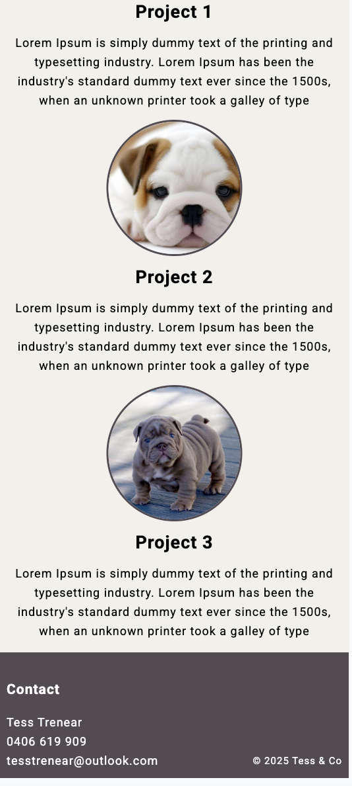

####  Desktop - Home Page
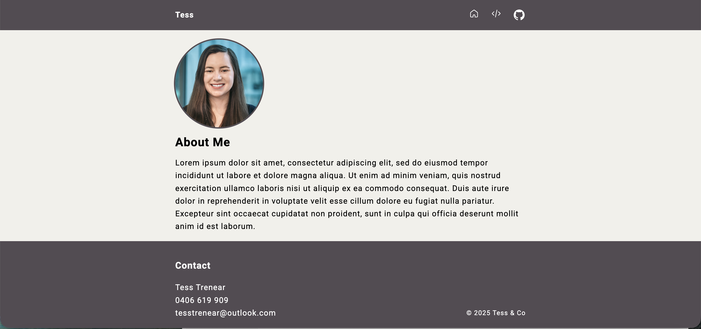

####  Desktop - Project Page 1
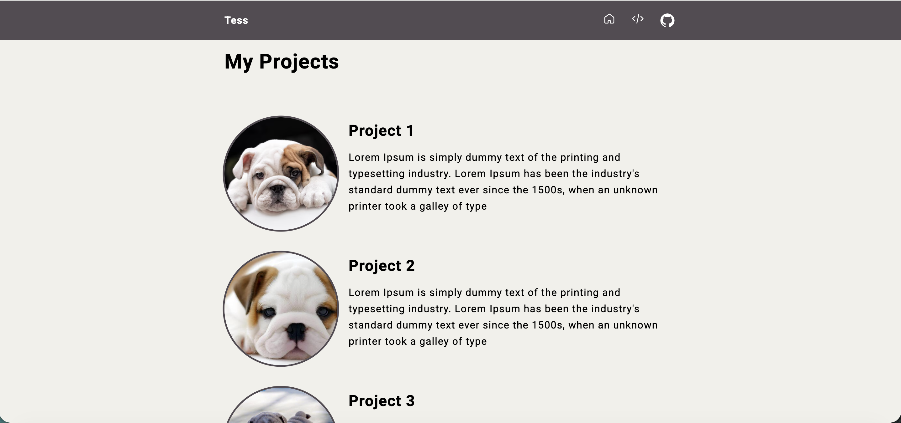

####  Desktop - Project Page 2 
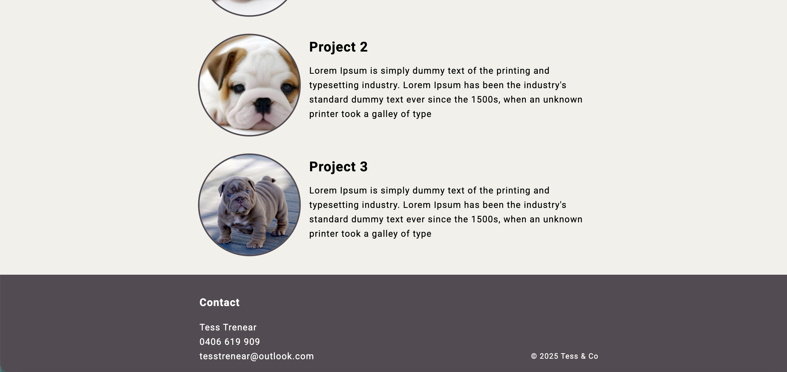

####  Features - Hover State
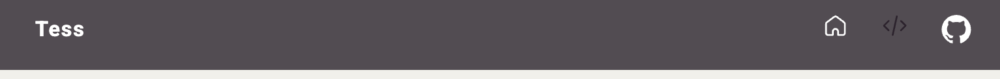